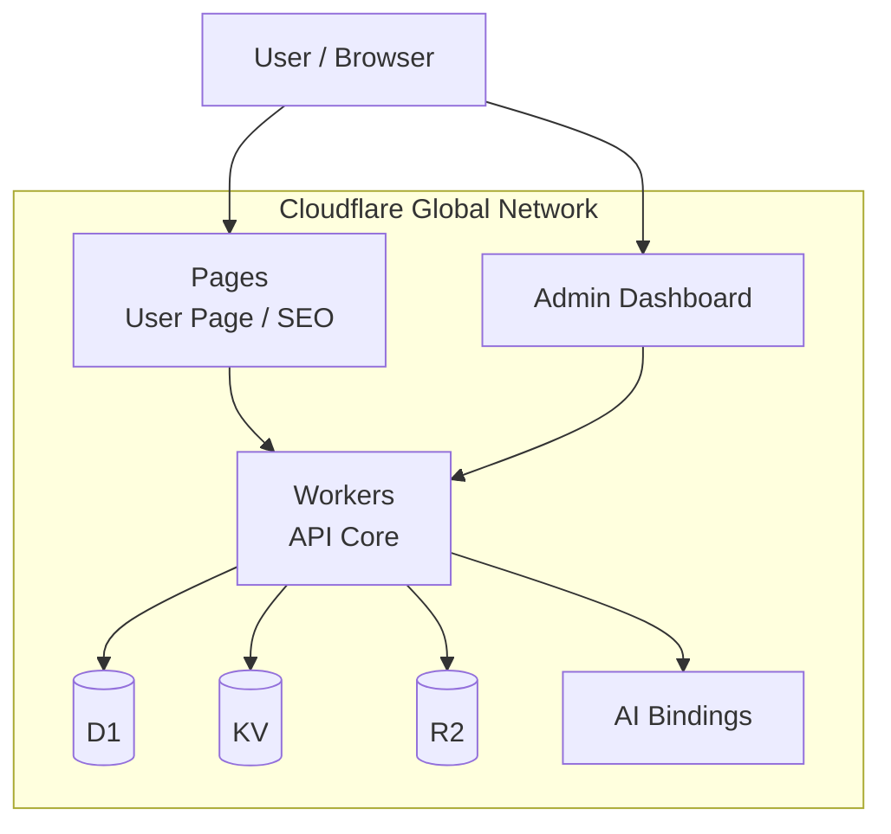

# ZeroPress

> **ZeroPress** is a modern, Cloudflare-native CMS built for both developers and non-developers.  
> Fast, secure, globally distributed — with zero traditional servers.

⭐ **GitHub Stars** &nbsp;&nbsp;|&nbsp;&nbsp; ⚡ **Cloudflare-native** &nbsp;&nbsp;|&nbsp;&nbsp; 🌍 **Global by default**

---

## Why ZeroPress?

### The problem
- Traditional CMS requires servers, databases, patching, and scaling
- Headless CMS solutions are powerful but often fragmented and complex

### The ZeroPress approach
- No servers to manage
- Git-friendly and API-driven
- Built entirely on Cloudflare primitives

### Who it’s for
- Developers who want control
- Teams who want speed
- Content creators who want simplicity

---

## Architecture at a Glance

**Cloudflare-native by design**
- Workers (API)
- Pages (Frontend)
- D1 / KV / R2 (Storage)
- Global edge execution with zero cold starts

---

## Repositories

ZeroPress is intentionally split by responsibility.

### Core & Platform
- **`zeropress-alpha-backend`**  
  Core API, authentication, content handling, and storage abstraction

### Admin & Operations
- **`zeropress-admin-dashboard1`**  
  Admin dashboard for managing content, users, and system settings

### Public Site
- **`zeropress_userpage_v3`**  
  User-facing pages optimized for SEO, performance, and global delivery

> 💡 This repository is the main entry point.  
> Dive into individual repositories when you want to build or contribute.

---

## Key Features

- ⚡ Edge-first CMS architecture
- 🌍 Global by default
- 🔐 Built-in authentication & security patterns
- 🧱 Modular and decoupled design
- 📦 Git-friendly workflows
- 🧠 AI-ready via Cloudflare AI bindings

---

## Getting Started

### I just want to try it
- Start with **`zeropress_userpage_v3`**
- Deploy to Cloudflare Pages in minutes

### I want to build with ZeroPress
- Explore **`zeropress-alpha-backend`**
- Extend APIs, auth flows, or storage layers

### I want to manage content
- Use **`zeropress-admin-dashboard1`**

> Detailed setup and deployment guides are available in each repository.

---

## Philosophy

ZeroPress is opinionated:

- Infrastructure should disappear
- Performance should be the default
- CMS should adapt to developers, not the other way around

We optimize for:
- Clarity over configuration
- Simplicity over feature bloat
- Long-term maintainability

---

## Roadmap (High-level)

- Stabilized Core API
- Plugin / extension model
- Theme system
- Multi-tenant support
- Improved admin UX
- Official documentation site

---

## Contributing

Contributions are welcome ❤️

- Start by opening an issue
- Small, focused pull requests are preferred
- See each repository’s `CONTRIBUTING.md` for details

---

## License

ZeroPress is licensed under the **Apache License, Version 2.0**.

See the [LICENSE](LICENSE) file for details.

---

## Links

- Documentation (coming soon)
- Discussions
- Issues

